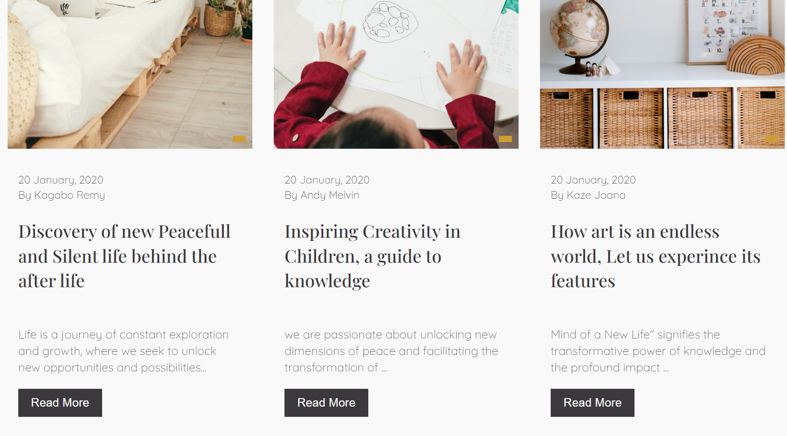
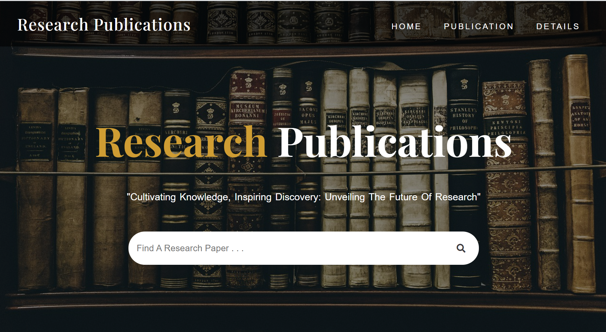

# A Research Publication Website.
gi
A complete A Research Publication Website that has the following features

#  One external CSS stylesheet.
#  Appropriate HTML tags for headings, paragraphs, lists, and other elements.
#  Uses CSS to style fonts, colors, backgrounds, borders, and other visual elements.
#  Uses CSS to style fonts, colors, backgrounds, borders, and other visual elements. Use CSS to style fonts, colors, backgrounds, borders, and other visual elements.
#  Uses CSS to create a responsive design that adapts to different screen sizes and devices.# Use CSS to create a navigation menu that allows users to access different pages of the website.
#  Uses CSS to create hover and active states for links and buttons

After getting the starter files, you need to go the file directory

and click on the Files with .html to view them 

